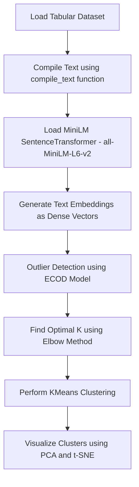

# 🧠 MarketMind: Customer Segmentation using LLM

MarketMind is an AI-powered customer segmentation pipeline that uses *Large Language Models (LLMs)* and advanced clustering techniques to transform unstructured customer data into meaningful, actionable segments. By leveraging the semantic understanding of LLMs, MarketMind enables marketers and analysts to uncover hidden behavioral patterns and customer personas with greater accuracy and clarity.

---

## 📌 Why Use LLMs for Customer Segmentation?

Traditional clustering methods often struggle with the complexity and variability of unstructured textual data such as reviews, preferences, and behavioral notes. LLMs address this challenge by offering:

- 🔍 **Semantic Embeddings**  
  Convert raw customer text into dense, context-rich vector representations using pretrained LLMs.

- 🧠 **Context-Aware Grouping**  
  Understand deeper intent and behavioral signals, enabling grouping based on meaning—not just keywords.

- 🗣 **Explainable Segmentation**  
  Generate natural-language summaries for each customer segment, making clusters interpretable and business-friendly.

---

---

## 🔁 Project Workflow

## ✨ OUTPUTS

📈 **K value using Elbow Method**  

🔵 **PCA 2D Projection**  

🔷 **PCA 3D Projection**  

🌈 **T-SNE 3D Visualization**  

